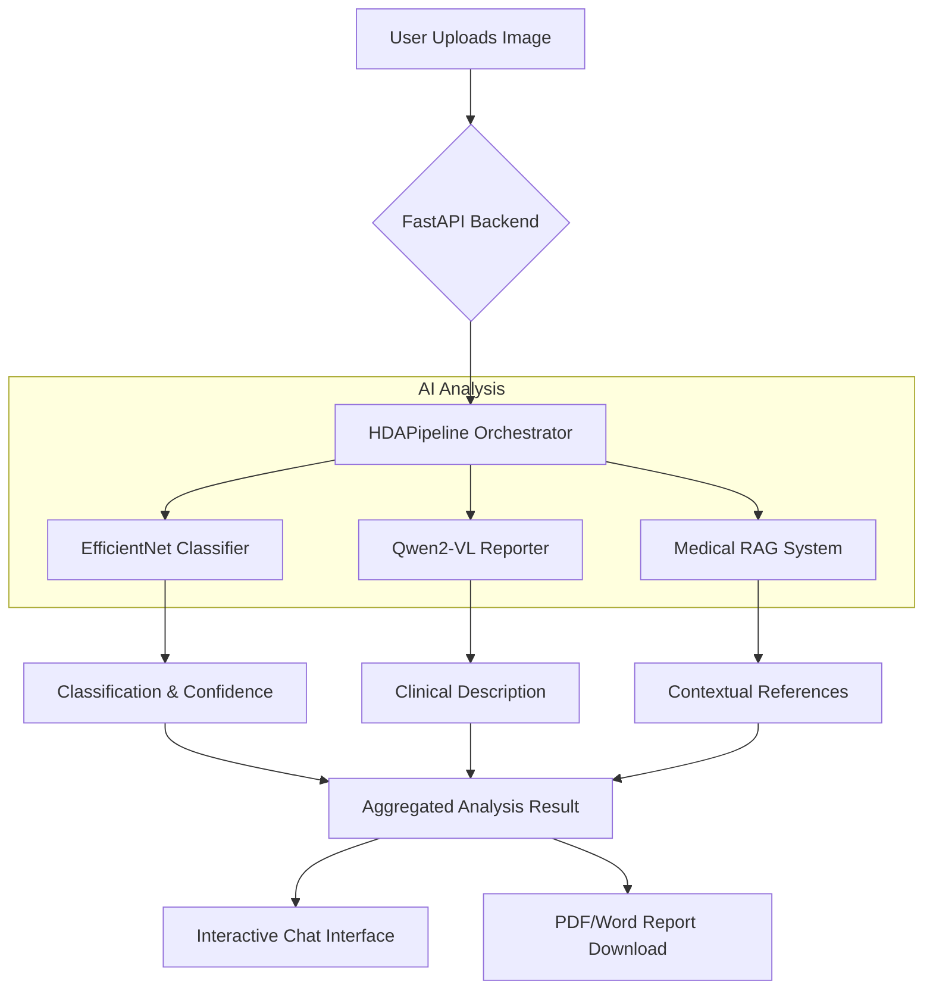

# 🏥 Health Data Analysis (HDA) AI Assistant - V3

[](https://www.python.org/)
[](https://fastapi.tiangolo.com/)
[](https://pytorch.org/)
[](LICENSE)

> **Revolutionizing Histopathology with AI-Powered Intelligence.**
> HDA V3 is an advanced medical diagnostic assistant that combines Deep Learning classification with Large Vision-Language Models (VLM) and RAG to provide comprehensive analysis of medical slides.

---

## 💡 The Idea & Purpose

The **Health Data Analysis (HDA) AI Assistant** is designed to empower medical professionals by providing a "second-opinion" screening tool for histopathology. By automating the identification of specific cancer types in lung and colon tissues, HDA reduces the diagnostic workflow latency and provides descriptive, evidence-based clinical reports.

### Key Features
-   🔬 **Precision Classification**: Detects Colon Adenocarcinoma, Lung Adenocarcinoma, and Squamous Cell Carcinoma with high confidence using a fine-tuned EfficientNet-B0.
-   📝 **AI-Generated Clinical Reports**: Leverages **Qwen2-VL** to generate natural language descriptions of visual pathological features.
-   💬 **Interactive Medical Chat**: Session-based AI consultation powered by **TinyLlama/Gemini** for follow-up questions.
-   📚 **Medical RAG System**: Integrates clinical guidelines and research papers using **ChromaDB** to provide cited, evidence-based answers.
-   🔥 **Visual Evidence**: Generates Grad-CAM heatmaps to highlight critical regions within pathology slides.

---

## 🛠 Tech Stack

### 🤖 AI & Machine Learning


Vision:
EfficientNet-B0 • Qwen2-VL

LLM:
TinyLlama • Google Gemini

---

### 🏗 Backend & Deployment


---

### 🎨 Frontend


---

## 🏗 Architecture Flow

The system operates as a modular pipeline where data flows from user input to comprehensive diagnostic output.



---

## 🚀 Getting Started

### Prerequisites
-   Python 3.9+
-   CUDA-compatible GPU (Recommended for local inference) or Gemini API Key.
-   16GB+ RAM.

### Installation

1.  **Clone the repository**:
    ```bash
    git clone https://github.com/your-username/HDA_V3.git
    cd HDA_V3
    ```

2.  **Install dependencies**:
    ```bash
    pip install -r requirements.txt
    ```

3.  **Setup Environment**:
    Create a `.env` file based on `.env.example`:
    ```env
    USE_GEMINI=True
    GOOGLE_API_KEY=your_key_here
    ```

### Running the App

```bash
python app.py
```
*Access the dashboard at `http://localhost:8000`*

---

## 📅 Roadmap

-   [ ] **V4 Expansion**: Support for X-Ray, MRI, and CT scan classification.
-   [ ] **Multi-Modal Integration**: Combined analysis of patient history (EHR) and images.
-   [ ] **Deployment**: Dockerization and Kubernetes scaling for clinical environments.

---

## 📄 Documentation

Detailed documentation can be found in the [`DOC/`](DOC/) directory:
-   [Software Requirements (SRS)](DOC/SRS.md)
-   [Architecture & Class Definitions](DOC/classes_and_pipelines.md)
-   [API Endpoints](DOC/endpoints.md)

---

Developed with ❤️ for the Medical Community.
